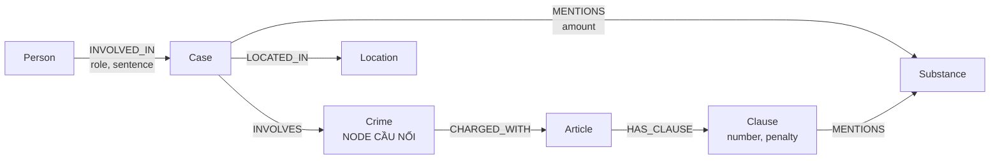

# Thiết kế Ontology — Day 19

**Họ tên:** Nguyễn Quang Duy  **MSSV:** 2A202602426

**Lựa chọn** (đánh dấu một):
- [X] Dùng ontology gợi ý (có thể chỉnh nhỏ)
- [ ] Tự thiết kế (xét bonus +15, xem `SUBMISSION.md`)

> Hướng dẫn: `LAB_GUIDE.md` Bước 2. Dùng ontology gợi ý thì vẫn phải điền đủ các mục dưới đây bằng lời của bạn.

## 1. Sơ đồ

Vẽ bằng mermaid (hoặc chèn ảnh `report/img/ontology.png`). Đánh dấu rõ **node cầu nối**.

## 2. Entity types (node labels)

| Label | Ý nghĩa | Khóa định danh (`MERGE` theo) | Properties | Lấy từ KB nào | Trích bằng (regex / LLM / khác) |
| --- | --- | --- | --- | --- | --- |
| Person | Người có liên quan đến vụ án/vụ việc | `name` | `name` | News | LLM |
| Case | Vụ án hoặc vụ việc được đề cập trong tin tức | `name` | `name`, `date` | News | LLM |
| Crime | Tội danh/hành vi phạm tội, đồng thời là node cầu nối | `name` | `name` | News + Law | LLM + chuẩn hóa |
| Substance | Chất/loại ma túy như MDMA, ketamine, methamphetamine | `name` | `name` | News + Law | Regex + LLM |
| Location | Địa điểm liên quan đến vụ việc | `name` | `name` | News | LLM |
| Article | Điều luật quy định tội danh | `number` | `number`, `title`, `law` | Law | Regex |
| Clause | Khoản thuộc một điều luật | `article + number` | `number`, `text`, `penalty` | Law | Regex |

## 3. Relationships

| Type | Từ → Đến | Properties trên cạnh | Ý nghĩa |
| --- | --- | --- | --- |
| INVOLVED_IN | Person → Case | `role`, `sentence` | Người liên quan đến vụ án với vai trò và mức án cụ thể |
| INVOLVES | Case → Crime | — | Vụ án liên quan đến tội danh/hành vi nào |
| CHARGED_WITH | Crime → Article | — | Tội danh được quy định tại điều luật nào |
| MENTIONS | Case → Substance | `amount` | Vụ án đề cập đến loại ma túy và khối lượng tương ứng |
| MENTIONS | Clause → Substance | — | Khoản luật đề cập đến loại ma túy nào |
| LOCATED_IN | Case → Location | — | Vụ án xảy ra hoặc liên quan đến địa điểm nào |
| HAS_CLAUSE | Article → Clause | — | Điều luật có các khoản tương ứng |

## 4. Node cầu nối giữa 2 KB

- **Node nào:** `Crime`
- **Vì sao chọn node này:** `Crime` xuất hiện về mặt ngữ nghĩa ở cả KB tin tức và KB pháp luật. Tin tức mô tả các vụ án gắn với một tội danh, còn KB luật quy định tội danh đó tại một điều luật. Vì vậy `Crime` cho phép đi từ `Case` trong News sang `Article` và `Clause` trong Law.
- **Cách đảm bảo hai phía khớp tên** (chuẩn hóa, `link_entity`, danh sách chuẩn trong prompt…): Chuẩn hóa tên tội danh trước khi `MERGE`, sử dụng `link_entity` và danh sách tên tội danh chuẩn trong prompt. Các cách diễn đạt tương đương được ánh xạ về cùng một tên chuẩn, ví dụ `mua bán trái phép chất ma túy`.
- **Khi nào cầu gãy, và bạn xử lý thế nào:** Cầu có thể gãy khi bài báo chỉ mô tả hành vi nhưng không nêu chính xác tội danh, LLM sinh tên tội khác với tên trong luật, hoặc KB luật chưa chứa điều luật tương ứng. Xử lý bằng cách chuẩn hóa tên, bổ sung alias, cải thiện prompt/entity linking và kiểm tra các `Crime` chưa có quan hệ `CHARGED_WITH`.

## 5. Competency questions

Với mỗi câu trong `data/benchmark_kg.json`, ghi đường đi trên graph dùng để trả lời. Câu nào không trả lời được thì ghi rõ lý do.

| Câu | Đường đi (Cypher pattern) | Trả lời được? |
| --- | --- | --- |
| Q1 | `(a:Article)-[:HAS_CLAUSE]->(cl:Clause)` → tìm điều/khoản chứa định nghĩa `tiền chất` | Có, nếu KB Law đã ingest điều luật chứa định nghĩa tiền chất |
| Q2 | `(p:Person)-[r:INVOLVED_IN]->(c:Case)-[:INVOLVES]->(cr:Crime)` → lọc `r.sentence` là tử hình | Có |
| Q3 | `(p:Person)-[r:INVOLVED_IN]->(c:Case)-[:INVOLVES]->(cr:Crime)-[:CHARGED_WITH]->(a:Article)-[:HAS_CLAUSE]->(cl:Clause)` | Có |
| Q4 | `(p:Person)-[:INVOLVED_IN]->(c:Case)-[:INVOLVES]->(cr:Crime)-[:CHARGED_WITH]->(a:Article)-[:HAS_CLAUSE]->(cl:Clause)` → lấy khung hình phạt cao nhất | Có, nếu Điều 255 đã được ingest |
| Q5 | `(p:Person)-[:INVOLVED_IN]->(c:Case)-[m:MENTIONS]->(s:Substance)` kết hợp `(c)-[:INVOLVES]->(cr:Crime)-[:CHARGED_WITH]->(a:Article)-[:HAS_CLAUSE]->(cl:Clause)-[:MENTIONS]->(s)` → dùng `m.amount` xác định khoản phù hợp | Có, nếu trích được đúng loại và khối lượng ma túy |
| Q6 | `(c:Case)-[:MENTIONS]->(s:Substance {name: "MDMA"})` kết hợp `(p:Person)-[:INVOLVED_IN]->(c)` → lấy các vụ và người liên quan | Có |

## 6. Quyết định thiết kế và đánh đổi

Ít nhất 3 quyết định. Mỗi quyết định ghi: đã chọn gì, phương án khác là gì, vì sao chọn.

1. Chọn `Crime` làm node cầu nối giữa News và Law. Phương án khác là nối trực tiếp `Case → Article`, nhưng dùng `Crime` giúp nhiều vụ án cùng liên kết tới một tội danh và từ đó tới điều luật tương ứng, giảm lặp dữ liệu và hỗ trợ truy vấn cross-KB.
2. Tách `Article` và `Clause` thành hai node thay vì lưu toàn bộ điều luật trong một node. Cách này giúp biểu diễn riêng từng khoản và khung hình phạt, cần thiết cho các câu hỏi phải xác định khoản luật dựa trên loại và khối lượng ma túy.
3. Lưu `role` và `sentence` trên cạnh `INVOLVED_IN` thay vì trên `Person`. Một người có thể xuất hiện trong nhiều vụ với vai trò và mức án khác nhau nên đây là thuộc tính của quan hệ giữa người và vụ án.
4. Biểu diễn `Substance` thành node riêng thay vì chỉ lưu dưới dạng text trong `Case`. Điều này giúp gom nhiều vụ cùng liên quan đến một chất như MDMA và hỗ trợ các câu aggregation như Q6.
5. Dùng regex cho dữ liệu luật có cấu trúc ổn định như số điều, số khoản và dùng LLM cho dữ liệu tin tức có cách diễn đạt đa dạng như người, vụ án, vai trò và tội danh.

## 7. So với ontology gợi ý (bắt buộc nếu xét bonus)

| Điểm khác | Gợi ý làm gì | Bạn làm gì | Vấn đề nó giải quyết | Bằng chứng (Cypher, hoặc số liệu benchmark) |
| --- | --- | --- | --- | --- |
| Không xét bonus | Dùng `Crime` làm node cầu nối và các entity/relationship gợi ý | Giữ ontology gợi ý, chỉ mô tả rõ cách chuẩn hóa và trích xuất entity | Đảm bảo tương thích với pipeline của bài và trả lời được các competency questions Q1–Q6 | Kiểm tra bằng benchmark Q1–Q6 sau khi build graph |

## 8. Hạn chế còn lại

Ontology hiện tại vẫn có một số hạn chế: `Person` và `Case` khóa theo tên nên có nguy cơ trùng hoặc gộp nhầm thực thể; `Substance` có thể không gộp được các tên đồng nghĩa nếu chưa chuẩn hóa; ngưỡng khối lượng trong các khoản luật chưa được mô hình hóa thành node hoặc thuộc tính có cấu trúc riêng nên việc xác định khoản vẫn phụ thuộc vào nội dung `Clause`; chưa phân biệt rõ các giai đoạn tố tụng như bắt, khởi tố, truy tố và xét xử. Ngoài ra, nếu tin tức chỉ mô tả hành vi mà không nêu đúng tên tội danh thì liên kết `Case → Crime → Article` vẫn phụ thuộc vào chất lượng của bước chuẩn hóa và entity linking.